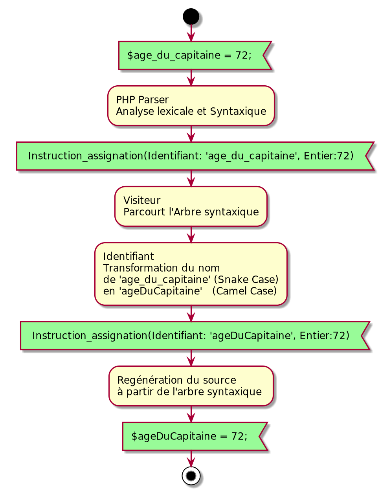

## Tutoriel: réusinage de programmes en PHP

### Auteur: Bernard BALLESTA 

### eMail: bernard@ballesta.fr

Date: mai 2021

# Objectifs, présentation

Définition du processus de réusinage par Wikipédia l'encyclopédie libre:

- [Réusinage](https://fr.wikipedia.org/wiki/Réusinage_de_code)

Le **réusinage** de code est l'opération consistant à:

- retravailler (restructurer) le code source d'un programme informatique,
- sans y ajouter de nouvelles fonctionnalités,
- sans en corriger les bogues.

Le terme **réusinage** est originaire du Québec Le terme anglais est "**refactoring**"

L'objectif de ce tutoriel est de présenter l'utilisation de l'outil "**PHP PARSER**"
pour faire du réusinage de code en PHP.

Le code source à réusiner est écrite en PHP. 

L'outil "**PHP PARSER**" utilisé pour modifier le code est lui aussi écrit
en PHP

# Types d'outils de réusinage

- Editeurs de texte
    - Les éditeurs de texte proposent des commandes de remplacement global d'une chaine de caractère par une autre
      portant sur le contenu d'un programme ou d'un dossier.

    - Des expressiosn régulières peuvent être mises à contribution pour sélectionner les mots à remplacer.

- Environnements de déveveloppements
    - Les IDE comme PHPStorm de JetBrain ou VS code de Microsoft proposent des stragegies de remplacement plus
      sophistiquée que les éditeurs de textes orienté caratères en
        - supportant les expressions régulières
        - distingant le code source et les commentaires
        - ayant la connaissance de la syntaxe du langage de programmation

    - Ces outils quoi que très puissant et utiles ont leur limites
        - Par exemple, changer les noms des variables d'un programme de conventions d'écriture
            - de "Snake case" ("date_de_naissance") qui était la pratique dominante dans les années 1980
            - vers "dateDeNaissance" en "Camel Case" qui est apparue plus tard
              [camelCase](https://commons.wikimedia.org/wiki/File:CamelCase.svg#/media/Fichier:CamelCase.svg)

- Les outils basés sur l'analyse syntaxiques des langages comme "**PHP PARSER**" que nous allons utiliser.

# Analyse syntaxique de programmes PHP par "**PHP PARSER**"


## Analyse lexicale

- L’analyse lexicale, est la conversion d’une chaîne de caractères (un texte)
  en une liste de symboles ("tokens" en anglais).
- Elle constitue la première phase de la plupart des compilateurs.

## Analyse syntaxique

- Un analyseur lexical est généralement combiné à un analyseur syntaxique pour analyser la syntaxe du texte basé sur la
  grammaire du langage.
- Les symboles générés par l'analyseur lexical sont ensuite traités par l'analyse syntaxique.

## Arbre syntaxique

L`arbre syntaxique du programme est:

- le résultat de l'analyse syntaxique
- sous forme d'une structure de données adaptés aux modifications et ajouts à faire par le processus de réusinage

### Visualisation d'arbres syntaxiques

Nous utiliserons l'outil [RSyntaxTree](https://yohasebe.com/rsyntaxtree/)

Outil permettant de générer la visualisation d'un arbre syntaxique à partir d'une version textuelle.

Utilisé dans ce tutoriel à des fins pédagogiques seulement.

Exemple de fragment de programme comportant deux assignations:

````
    $pi = 3.14;
    
    $révolution-Française = 1798;
````

Texte de l'**arbre syntaxique** utilisé par
[RSyntaxTree](https://yohasebe.com/rsyntaxtree/) pour afficher l'arbre syntaxique sous forme graphique:

````
[PROGRAMME
    [ASSIGNATION
        [VARIABLE PI]
        [NOMBRE-FLOTTANT 3.14]
    ]
    [ASSIGNATION
        [VARIABLE révolution-Française]
        [NOMBRE-ENTIER 1789]
    ]
]
````

Diagramme généré par le logiciel "**rsyntaxtree**":


Les arbres syntaxiques sont générés par PHP-PARSER  afin de nous donner la possibilité de les modifier.

L'arbre syntaxique sera ensuite retraduit en code source PHP.

# Vérifications de la configuration avant installation

- Ce tutoriel est réalisé sur le système d'exploitation **Ubuntu version 20.04**:

    ````
       lsb_release -a
  
       Distributor ID:	Ubuntu
       Description:	Ubuntu 20.10
       Release:	20.10
       Codename:	groovy
    ````

- Vous devez disposer des logiciels suivants:
    - **Composer**
      ````
        composer --version
        Composer version 2.0.9 2021-01-27 16:09:27
      ````
      Composer sera utilisé pour charger  "**PHP PARSER**"           

    - **PHP**
        - Php version supérieure ou égale à la 7.0
        - **PHP 7.4** est utilisé pour les besoins de ce tutoriel
            ````
            php -v
            PHP 7.4.16 (cli) (built: Mar  5 2021 07:54:56) ( NTS )
            Copyright (c) The PHP Group
            Zend Engine v3.4.0, Copyright (c) Zend Technologies
            with Zend OPcache v7.4.16, Copyright (c), by Zend Technologies
            ````

# Creation du projet

Créer un dossier "reusinage_PHP" pour notre projet:

````
mkdir reusinage_PHP
````

# Installation de PHP PARSER

# Exemple de réusinage réalisé par la suite de ce tutoriel

# Réusinage avec "**PHP PARSER**" 

Analyse syntaxique du programme suivi du parcours de l'arbre généré par un visiteur.



# Pour aller plus loin

Nous allons appliquer le même changement aux noms de fonctions.

